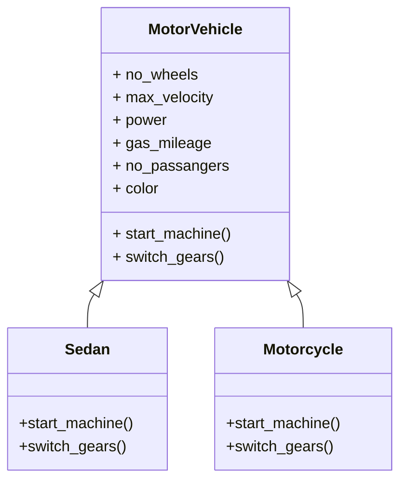

Description of class Vehicle
=================================

Here we are going to describe different types of vehicles

We are going to consider the following attributes:
---------------------

* no_wheels
* max_velocity
* power
* gas_mileage
* no_passangers
* color

```python
class MotorVehicle:
    no_wheels = 0
    max_velocity = 0
    power = 0
    gas_mileage = 0
    no_passangers = 0
    color = None

```


